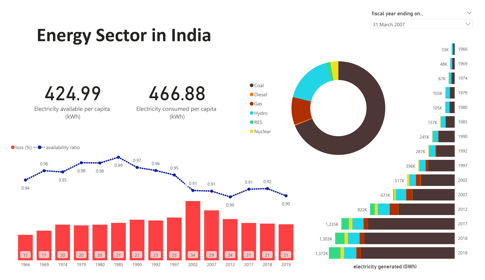

## **An Analysis of the Energy Sector in India**

### - Stakeholders

* Citizens of India.
* Ministry of Power.
* Central Electricity Authority.

### - Stakeholder goals 

* Energy independence.
* Greener energy.

### - Key factors

* Energy usage in India.
* Population growth.
* Switch to renewable energy.

### - Data needed

* Historic energy-related data.
* Historic population data.

### Data sources

* [link to the energy data](https://cea.nic.in/wp-content/uploads/pdm/2020/12/growth_2020.pdf).
* [link to the population data](https://data.worldbank.org/indicator/SP.POP.GROW?end=2020&locations=IN&start=1961).
* [link to 1961 population data](https://web.archive.org/web/20081219073658/http://indiabudget.nic.in/es2006-07/chapt2007/tab97.pdf).

### - Tasks

* Build an interactive dashboard displaying the key indicators in the energy sector.
* An analysis report of the historic data of the Indian energy sector.

### - Key metrics

* Annual energy consumption.
* Annual energy consumption per capita.
* Energy consumption growth rate.
* Production-to-Consumption rate.
* Proportion of renewable sources.

### - Limitations

* Fiscal year used.
